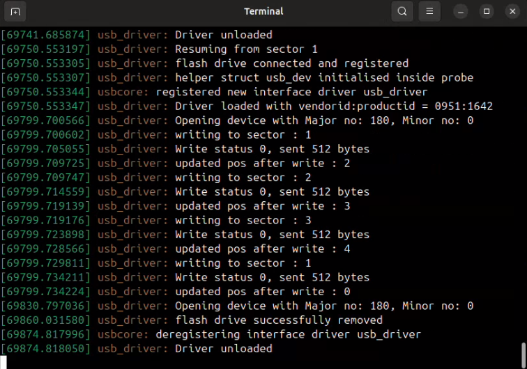
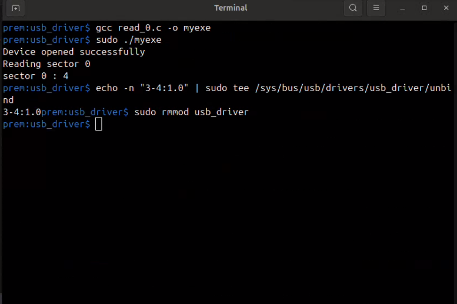

# Linux Device Driver for USB Flash Drive

A **Linux Kernel Device Driver** that allows users to perform **raw sector read and write operations** directly on a USB flash drive.

This driver exposes a device interface that enables applications to interact with the flash drive using standard system calls such as:

- open()
- read()
- write()
- lseek()

The goal of this project is to **bypass the filesystem layer** and directly access **raw sectors of a USB flash drive** from a custom Linux kernel module.

---

# Features

- Custom Linux Kernel USB Driver
- Direct raw sector read/write
- Supports system calls:
  - `open()`
  - `read()`
  - `write()`
  - `lseek()`
- Works with **512-byte sector size**
- Demonstrates **kernel and user space communication**

---

# Project Architecture

```
User Application
       │
       │ System Calls
       ▼
   VFS Layer
       │
       ▼
Custom USB_Driver (Kernel Module)
       │
       ▼
    USB Core
       │
       ▼
USB Host Controller
       │
       ▼
USB Flash Drive (Raw Sector Access)
```

---

# Requirements

- Linux System
- Kernel Headers
- GCC Compiler
- Make Utility
- USB Flash Drive (preferably a test drive)

---

# Warning

⚠️ This driver performs **raw sector operations**.

Using it on a USB drive containing important data may **corrupt the filesystem**.

Always use a **test or non-essential USB drive**.

---
# Steps to Build, Load, and Use the USB Driver

## Clean USB Flash Drive (Before Using the Driver)

Before using the custom USB driver, it is recommended to **wipe the USB flash drive** to remove any existing filesystem, partitions, or leftover data.  
This ensures that the driver performs **raw sector operations on a clean device**.

⚠️ **Warning**

This operation will **permanently erase all data** on the USB flash drive.

---

### Step 1 – Identify the USB Device

Insert the USB flash drive and run:

```
lsblk
```

Example output:

```
sda    3.7G
sdb    16G
```

In this example:

```
/dev/sda
```

is the USB flash drive device file.

---

## Step 2 – Zero Out the USB Drive

Use the `dd` command to overwrite the USB drive with zeros.

```
sudo dd if=/dev/zero of=/dev/sdb bs=512 status=progress
```

### Explanation

| Parameter | Description |
|----------|-------------|
| `if=/dev/zero` | Input stream of zeros |
| `of=/dev/sdb` | Target USB device |
| `bs=512` | Write in 512-byte blocks (sector size) |
| `status=progress` | Shows write progress |

---

## Unbind Default usb-storage Driver

```
echo "3-4:1.0" | sudo tee /sys/bus/usb/drivers/usb-storage/unbind
```
Note: Replace interface path i.e "3-4:1.0" with your drive's interface path using comman  "sudo dmesg -w"

---

## Build the Driver

```
make
```

This will generate:

```
usb_driver.ko
```

---

## Load the Driver

```
sudo insmod usb_driver.ko vendorid=0x0291 productid=0x0242
```

Check if the module is loaded:

```
lsmod | grep usb_driver
```

View kernel logs:

```
sudo dmesg -w
```

---


## Bind Custom Driver

```
echo "3-4:1.0" | sudo tee /sys/bus/usb/drivers/usb_driver/bind
```
---
## Device File

```
/dev/usb_driver0
```

User programs interact with the driver through this device file.

---
## Example Operations

Open device

```c
fd = open("/dev/usb_driver0", O_RDWR);
```

Write sector

```c
write(fd, buffer, 512);
```

Move to sector

```c
lseek(fd, sector_number, SEEK_SET);
```

Read sector

```
read(fd, buffer, 512);
```

---

# Screenshots

## Kernel Logs (dmesg) Showing usb_driver Logs





---

# Project Structure

```
usb-driver
│
├── usb_driver_header.h
├── usb_driver.c
├── .gitignore
├── read_0.c
├── test_1.c
├── Makefile
├── README.md
└── Screenshots
    ├── usb_driver_1.png
    └── usb_driver_2.png
```


---

# Author

**Prem Choudhary**

Linux Kernel | System Programming | Device Drivers